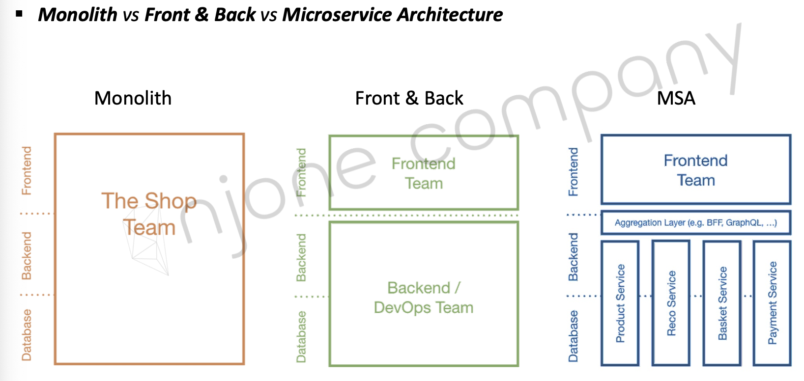

# Section0: MicroService와 Spring cloud
## 소프트웨어 아키텍처

> * Monolithic 구조로 fragile한 구조라고 할 수 있음 -> 하나의 서비스라도 고장나면 나머지도 다 망가지는 구조
> * Resilient / Anti-Fragile 구조로 변하면서 Cloud 구조와 함께 서비스의 안정성과 운영의 확장성 등을 높이는 방향으로 변하고 있음
>   * 인스턴스를 지정할 수 있고, 사용량에 따라 인스턴스의 개수가 변동 가능
>   * 수 작업에 의해 처리하는 것이 아니라, 리소스 사용량에 따라 자동으로 설정 가능

### Anti-fragile
1. Auto scaling
2. Microservices
3. Chaos engineering
    1. 변동(불확실성)에 대한 대처
4. Continuous deployments

---

## Cloud Native Architecture

* 확장 가능한 아키텍처
  * 시스템의 수평적 확정에 유연 -> 가상 서버와 리소스로 시스템의 상황에 따라 변동 가능
  * 확장된 서버로 시스템의 부하 분산, 가용성 보장
    * 스케일 업: 하드웨어 사양 높이는 것
    * 스케일 아웃: 인스턴스 여러대 배치로 사용자의 요청 대응
  * 시스템 또는 서비스 애플리케이션 단위의 패키지 (컨테이너 기반)
  * 모니터링
 
* 탄연적 아키텍처
  * 서비스 생성 - 통합 - 배포, 비즈니스 환경 변화에 대응 시간 단축
  * 분할된 서비스 구조 -> 종속성 최소화
  * Stateless 통신 프로토콜
  * 서비스의 추가와 삭제 자동으로 감지
  * 변경된 서비스 요청에 따라 사용자 요청 처리 (동적 처리)
* __장애 격리__
  * 특정 서비스에 오류가 발생해도 다른 서비스에 영향을 주지 않음

---

## Cloud Native Application
* 지속적인 통합 CI (Continuous Integration)
  * 통합 서버, 소스 관리(SCM), 빌드 도구, 테스트 도구
  * ex) Jenkins, Team CI, Travis CI
    * 커밋과 동시에 빌드, 테스트를 통해 다른 서비스와 문제 발생 여부 확인 가능
* 지속적 배포
  * Continuous Delivery (수동 반영)
  * Continuous Deployment (자동 반영)
  * Pipe line
* 카나리 배포와 블루 그린 배포
    * 카나리 배포: 95% 사용자는 이전 버전 서비스, 5% 사용자는 새 버전 서비스
    * 블루그린 배포: 이전 버전 사용자의 트래픽을 점진적으로 신 버전에 적용
### Container 가상화

> 기존보다 가볍고 빠르게 작동할 수 있는 특징이 있음

---

## Factors

1. One codebase, one application
   1. 지속적인 관리를 위한 통일화된 코드 베이스
2. API first
   1. API 형태로 서비스 제공. 사용자 측면에서 서비스 고려
3. Dependency management
   1. 전체 시스템에 영향을 줘선 안됨
4. Design, build, release, and run
5. Configuration, credentials, and code
   1. 시스템 코드 외부에서 구성 관리 도구를 통해 마이크로 서비스의 작업 제어
6. Logs
   1. 하나의 시스템 안에서 로그를 출력하는 로직이 분리되어야 함.
   2. 모니터링 도구 등 사용
7. Disposability
   1. 서비스 인스턴스 자체가 삭제가 가능해야 함. 정상적으로 종료가 가능해야 함
8. Backing Services
   1. 마이크로 서비스가 가져야할 보조 서비스를 추가로 지원. without dependency 
9. Environment parity
   1. 직접 Access하는 기능을 배제 하고, 상호간 종속적이지 않아야 함
10. Administrative processes
    1. 관리자용 데이터 분석 등의 도구 필요
11. Port binding
    1. 자체 포트에서 노출되는 인터페이스 및 기능이 있어야 함
12. Stateless processes
    1. 실행 중인 서비스와 분리되어 자체적으로 실행될 수 있어야 함
13. Concurrency
    1. 많은 수의 동일한 프로세스를 복사하여 부하 분산
14. Telemetry
    1. 시각화로 제공
15. Authentication and authorization
    1. 마이크로 서비스라도 인증 필수

---

## Monolithic vs MSA

### Monolith Architecture
* 모든 비즈니스 로직이 **하나의 애플리케이션** 형태로 패키지 되어 서비스
  * 시스템의 일부분만 변경되도, 새로 빌드하고 배포해야하는 단점이 이씅ㅁ
* 애플리케이션에서 사용하는 데이터가 한 곳에 모여 참조되어 서비스 되는 형태

### MSA
> 마이크로 서비스란?
> * 함께 작동하는 작은 규모의 서비스
> * HTTP 통신의 리소스 API를 통한 작은 서비스
> * 최소한의 중앙 집권식, 서로 독립적인 언어와 DB를 사용

* 스마트 디바이스의 발달로 여러가지 디바이스를 고려해야 함.
* 사용자의 요청처리를 상황에 맞게 개발해야함.

---

## MicroService

> 아마존의 마이크로 서비스 사용 방식
> * 직접적인 연결 - ip address, 권한을 가진 계정을 통한 접근, DNS 등을 통한 접근이 아니라 **서비스 인터페이스**를 통해서만 통신
> * 프로토콜 기술은 전혀 상관 없음
> * 모든 서비스 인터페이스는 외부에 공개가 가능 해야함

### 마이크로서비스의 특징
1. Challenges
2. Small Well Chosen Deployable Units
3. Bounded Context
4. RESTful
5. Configuration Management
6. Cloud Enabled
7. Dynamic Scale Up And Scale Down
8. CI/CD
9. Visibility

### 마이크로 서비스를 도입할 때 고려할 점
> 1. 공수가 얼마나 들 것인가
> 2. 독립적으로 개발되고 운영될 수 있도록 경계가 잘 구분이 되어 있는지
> 3. 유지보수 및 확장성이 잘 되어 있는지
> 4. 오류의 독립적인가 -> 다른 마이크로서비스의 영향 최소화
> 5. 외부 종속성과의 상호작용 최소화
> 6. 여러 기술 적용 가능성

---

### SOA와 MSA 차이점
* SOA(Servic Oriented Architectrue)
    * 비즈니스 측면ㅇ에서의 서비스 재사용성
    * ESB(Enterprise Service Bus)라는 서비스 채널 이용 -> 서비스 공유, 재사용
* MSA(Microservice Architecture)
    * 한 가지 작은 서비스에 집중
    * 서비스 공유하지 않고 독립적 실행

* 서비스 공유 지향점
    * SOA: 재사용을 통한 비용 절감
    * MSA: 서비스 간의 결합도를 낮추어 변화에 능동적으로 대응
      
* 기술 방식
  * SOA: 공통의 서비스를 ESB에 모아 사업 측면에서 공통 서비스 형식으로 서비스 제공
  * MSA: 각 독립된 서비스가 노출된 REST API를 사용
      

### RESTful Web Service
* LEVEL 0
  * REST 방식의 애플리케이션 보다 기존의 리소스를 web service로 배포하기 위해 url만 변경된 상태
* LEVEL 1
  * 적절한 uri로 리소스를 처리
  * http 메소드의 사용은 제대로 사용되지 않음
* LEVEL 2
  * LEVEL 1 + http 메소드 설계
* LEVEL 3
  * LEVEL2 + HATEOAS
  * DATA를 가지고, 다음 단계에서 어떤 액션을 할 수 있는지 고려한 단계

> 1. 소비자 우선 -> 직접 소비자 뿐만 아니라 API를 사용하는 클라이언트도 포함
> 2. HTTP 사용 최적화
> 3. 적절한 Request 메소드 - GET, POST, PUT, DELETE
> 4. 적절한 Response Status 전달 - 200, 404, 400, 201, 401
> 5. URI에 취약 정보 제거
> 6. 데이터 복수 형태 제공
> 7. 리소스 명사 형태 사용
> 8. 일괄적인 엔드포인트 사용

---

## MicroService Architecture Structures
MSA 표준 구성 요소

서비스 간 통신을 추상화하고 안전하고 빠르게 만들어주는 Infrastructure layers

* MSA 인프라 -> 미들웨어
  * 프록시 역할, 인증, 권한 부여, 암호화, 서비스 검색, 요청 라우팅, 로드 밸런싱
  * 자가 치유 복구 서비스
* 서비스간의 통신과 관련된 기능을 자동화

CNCF에서 제공하는 서비스

MSA 기반 기술
1. Gateway
2. Resilient Service Mesh/Meta Services
3. Runtime
4. Frameworks
5. Automation
6. Backing Services
7. Telemetry

---
s